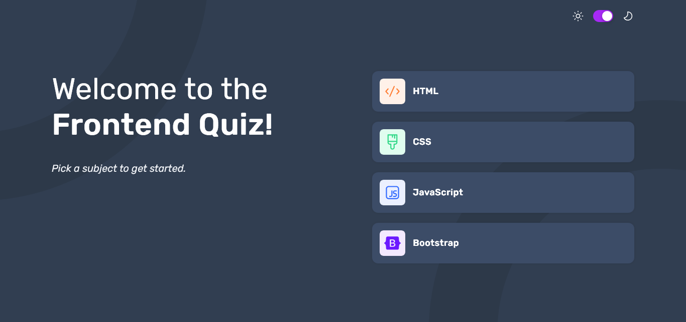

# Frontend Mentor - Easybank landing page solution

This is our solution to the [Frontend quiz app challenge on Frontend Mentor](https://www.frontendmentor.io/challenges/frontend-quiz-app-BE7xkzXQnU). Frontend Mentor challenges help you improve your coding skills by building realistic projects.

**NOTE: We did not have access to the Figma/Sketch file, so the design is far from being pixel perfect.**

## Table of contents

- [The challenge](#the-challenge)
- [Screenshots](#screenshots)
- [Links](#links)
- [Built with](#built-with)
- [Authors](#authors)

## The challenge

Users should be able to:

- Select a quiz subject
- Select a single answer from each question from a choice of four
- See an error message when trying to submit an answer without making a selection
- See if they have made a correct or incorrect choice when they submit an answer
- Move on to the next question after seeing the question result
- See a completed state with the score after the final question
- Play again to choose another subject
- View the optimal layout for the interface depending on their device's screen size
- See hover and focus states for all interactive elements on the page
- Navigate the entire app only using their keyboard
- **Bonus**: Change the app's theme between light and dark

## Screenshots

### Dark Start View

### Light Start View

### Dark Quiz View

### Light Incorrect Answer View

### Dark Final Result View

## Links

- Give it a try and see if you're worthy of seeing confetti! : [Quiz App](https://frontend-quiz-app-three.vercel.app/)

## Built with

- Semantic HTML5 markup
- CSS Custom Properties
- Vite
- ESlint
- JavaScript
- DOM Manipulation
- Event Handling
- tsparticles/confetti

## Authors

- [@Marvin-Figueroa](https://www.frontendmentor.io/profile/Marvin-Figueroa)
- [@Andrea-Villatoro](https://github.com/Alejandra720)
- [@Rafael-Arevalo](https://github.com/dev-rafael-arevalo)
- [@William-Zelaya](https://github.com/William-Zelaya)
